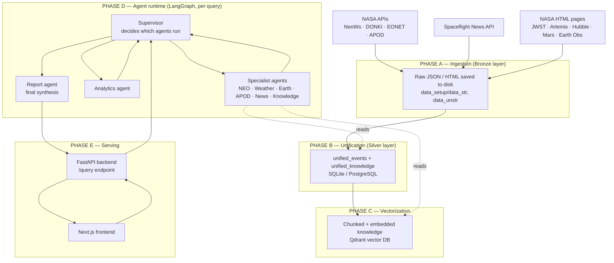
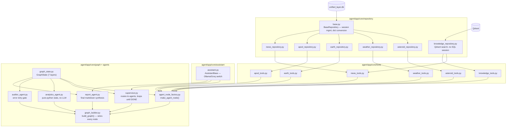
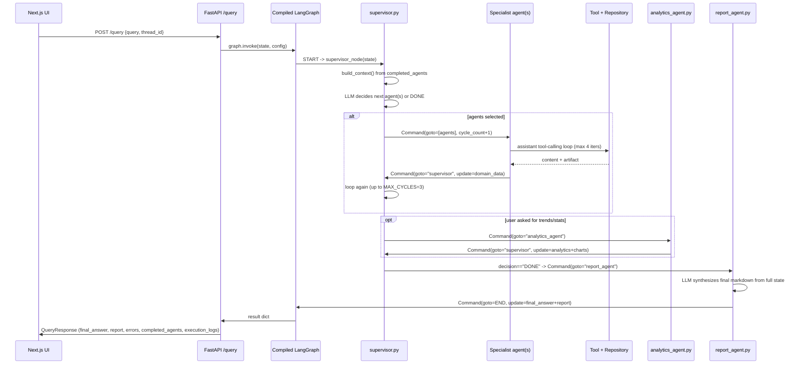
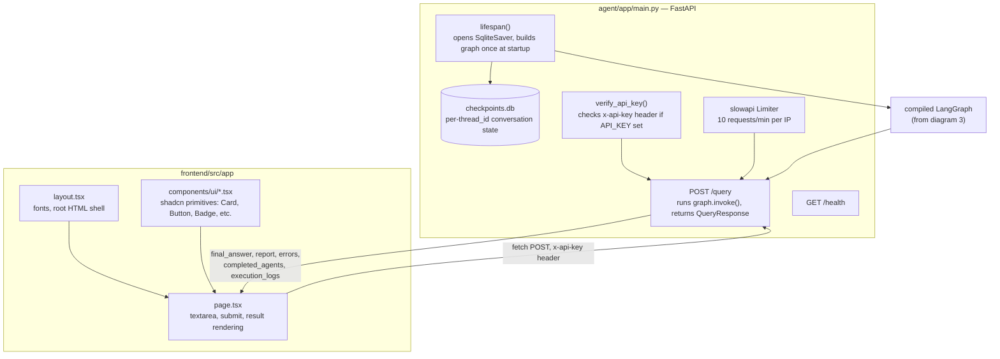

# Architecture Diagrams — Space Intelligence Platform

This document contains a high-level system diagram, followed by four detailed
low-level diagrams that map every file in the repo to the phase it belongs
to and what it connects to. All diagrams are Mermaid — they render natively
on GitHub, and in any Mermaid-aware viewer.

---

## 1. High-Level Diagram — the 5 macro phases

Phases A–C run offline/on a schedule to prepare data. Phase D runs live on
every user query. Phase E is what exposes it to a human.

---

## 2. Low-Level Diagram — Data Pipeline (Ingestion → Silver → Vector)

Every box here is one real file in the repo. Arrows show which file feeds
which, in the exact order you'd run them.

```mermaid
flowchart TD
    subgraph CONFIG["data_setup/config"]
        C1["datasets_str.json<br/>neows, donki, eonet, apod, spaceflight_news"]
        C2["datasets_unstr.json<br/>jwst, artemis, hubble, mars, earth_observatory"]
    end

    subgraph INGEST["data_setup/ingestion — Bronze layer"]
        SETTINGS["scripts/settings.py<br/>loads NASA_API_KEY from .env"]
        FS["fetch_str.py<br/>GET each JSON API, save timestamped raw file"]
        FU["fetch_unstr.py<br/>GET each HTML page, save timestamped raw file"]
        BRONZE_STR[["data_setup/data_str/&#123;provider&#125;/&#123;dataset_id&#125;/*.json"]]
        BRONZE_HTML[["data_setup/data_unstr/&#123;provider&#125;/&#123;dataset_id&#125;/*.html"]]
    end

    subgraph UNIFIED["data_setup/unified_layer — Silver layer"]
        MODELS["models.py<br/>UnifiedEvent + UnifiedKnowledge (SQLAlchemy)"]
        DATABASE["database.py<br/>engine + SessionLocal + init_db()"]
        BASE_T["transformers/base.py<br/>BaseTransformer interface"]
        T_NEOWS["transformers/neows.py"]
        T_DONKI["transformers/donki.py"]
        T_EONET["transformers/eonet.py"]
        T_APOD["transformers/apod.py"]
        T_SFN["transformers/spaceflight.py"]
        T_HTML["transformers/html_docs.py"]
        REGISTRY["transformers/__init__.py<br/>TRANSFORMER_REGISTRY"]
        ENGINE["engine.py<br/>UnifiedEngine.run_pipeline()"]
        DB[("unified_layer.db<br/>unified_events / unified_knowledge")]
    end

    subgraph VECTORL["data_setup/vector_layer"]
        BUILDER["builder.py<br/>VectorKnowledgeBuilder"]
        QDRANT[("Qdrant<br/>unified_knowledge_collection")]
    end

    C1 --> FS
    C2 --> FU
    SETTINGS --> FS
    FS --> BRONZE_STR
    FU --> BRONZE_HTML

    BASE_T --> T_NEOWS & T_DONKI & T_EONET & T_APOD & T_SFN & T_HTML
    T_NEOWS & T_DONKI & T_EONET & T_APOD & T_SFN & T_HTML --> REGISTRY
    MODELS --> DATABASE
    DATABASE --> ENGINE
    REGISTRY --> ENGINE
    BRONZE_STR --> ENGINE
    BRONZE_HTML --> ENGINE
    ENGINE -->|"session.merge() per record"| DB

    DB -->|"fetch_knowledge_documents()"| BUILDER
    BUILDER -->|"chunk + embed<br/>all-MiniLM-L6-v2"| QDRANT
```

**How to read this:** `datasets_str.json` / `datasets_unstr.json` declare
*what* to pull. `fetch_str.py` / `fetch_unstr.py` pull it onto disk
(Bronze). `engine.py` picks the right transformer per `dataset_id` (via the
`TRANSFORMER_REGISTRY`), converts raw files into `UnifiedEvent` /
`UnifiedKnowledge` rows, and merges them into `unified_layer.db` (Silver).
`builder.py` then reads every `UnifiedKnowledge` row, chunks it, embeds it,
and upserts it into Qdrant.

---

## 3. Low-Level Diagram — Agent Core (Repositories → Tools → Graph)

**How to read this:** Repositories are the only files allowed to open a DB
session or query Qdrant. Tools wrap repositories in LangChain's `@tool`
decorator so an LLM can call them. `agent_node_factory.py` wraps a tool set
+ an `AssistantBase` instance into a runnable LangGraph node. `graph_builder.py`
is the file that actually registers every node and compiles the graph —
nothing here runs until that file's `build_graph()` is called.

> Note: `auditor_agent.py` is registered as a node but is not currently
> reached by `supervisor.py`'s routing logic — see the "Known Gaps" section
> of `SYSTEM_DOCUMENTATION.txt` for details.

---

## 4. Low-Level Diagram — Runtime Sequence (one user query, step by step)

---

## 5. Low-Level Diagram — Backend + Frontend

---

*For prose-level detail on every file's exact logic, see `SYSTEM_DOCUMENTATION.txt`.*
